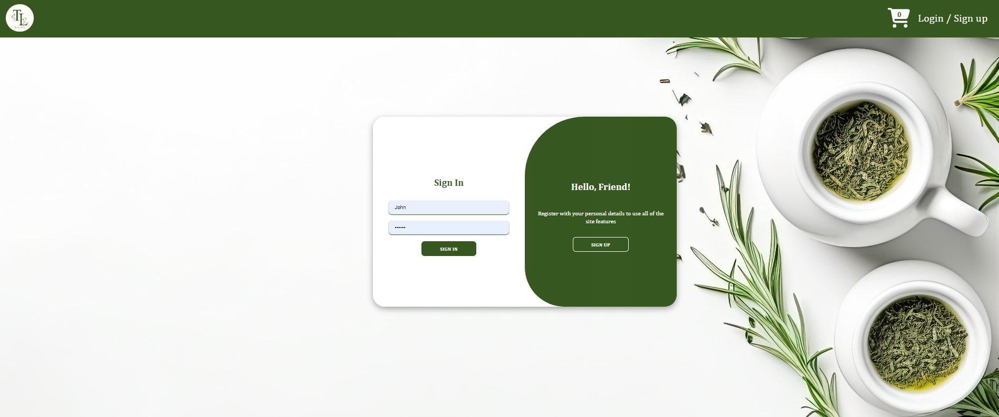
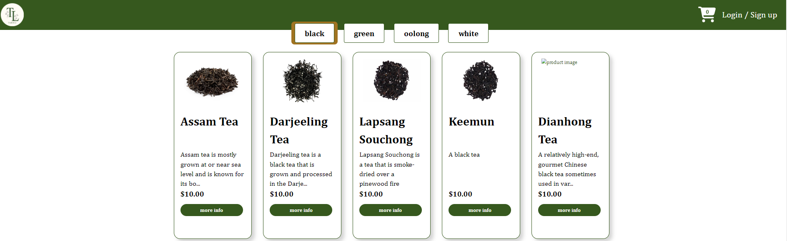

# TeaLicious

## Description
Welcome to our Tea eCommerce Shop! This application allows users to browse and purchase a variety of teas. The project uses modern web technologies to deliver a seamless and interactive user experience.

## Table of Contents 
[Technologies](#technologies) 
[Installation](#installation) 
[Usage](#usage) 
[GraphQL API](#graphql-api) 
[Screen Shots](#screenshots) 
[Contribution](#contribution) 
[Contact](#contact)

## Technologies
This project utilizes the following technologies:
* React: A JavaScript library for building user interfaces.
* GraphQL: A query language for APIs and a server-side runtime for executing queries.
* Node.js: A JavaScript runtime built on Chrome's V8 engine.
* Express.js: A web application framework for Node.js.
* MongoDB: A NoSQL database for storing data.
* Mongoose: An ODM (Object Data Modeling) library for MongoDB and Node.js.

## Installation
Prerequisites:
* Node.js (v14 or later)
* npm for package management
* MongoDB (local installation or a cloud instance)

### Clone the Repository
1. git clone https://github.com/swe-thinhnguyen1701/TeaLicious
2. Backend Setup  
cd server  
install dependencies - npm install  
npm run seed  
npm run develop  
3. Frontend Setup  
cd client  
install dependencies - npm install  
npm run seed  
npm run develop  

## Usage
Once both the frontend and backend servers are running, you can access the application by navigating to http://localhost:3000 in your browser.

## GraphQL API
The application uses GraphQL for querying and mutating data. Here are some example queries and mutations:
* Get all teas: query {
  teas {
    id
    name
    description
    price
    stock
  }
}

* Get a tea by ID: query {
  tea(id: "tea-id") {
    id
    name
    description
    price
    stock
  }
}

* Mutations
Add a new tea: mutation {
  addTea(input: {
    name: "Green Tea"
    description: "A refreshing green tea."
    price: 10.00
    stock: 100
  }) {
    id
    name
    description
    price
    stock
  }
}

* Update tea stock: mutation {
  updateTea(id: "tea-id", input: { stock: 50 }) {
    id
    name
    stock
  }
}

## Screenshots

## Contribution
Feel free to contribute to this project by opening issues, submitting pull requests, or suggesting features. Please ensure your contributions adhere to the project's code style and include appropriate tests. 

## Contact
Thank you for visiting!

If you would like to learn more, feel free to contact us. 

GitHub URL: https://github.com/swe-thinhnguyen1701
